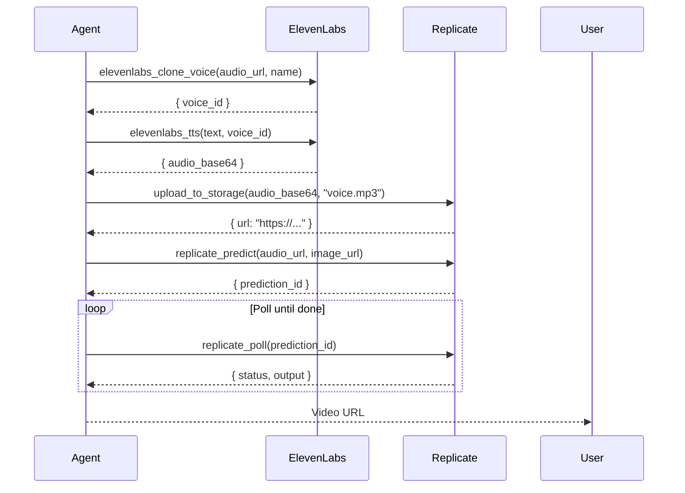
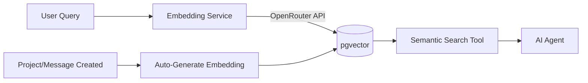

# AI Assistant Module Documentation

> **Status**: Stable v1.0
> **Stack**: NestJS (Backend), LangChain (Logic), Next.js (Frontend), Supabase (Data)

The `ai-assistant` module is a **Read-Only, RAG-lite** system designed to give Super Admins natural language access to the database. It follows a strict **Backend-for-Frontend (BFF)** pattern where the generic AI logic resides in the backend, and the frontend handles presentation and context.

---

## 🏗️ Architecture

```mermaid
graph TD
    User[User (Frontend)] -->|Action| FA[Frontend Actions]
    FA -->|HTTP POST /chat| BC[Backend Controller]
    BC -->|AuthGuard| AS[AiAssistantService]
    AS -->|Context Injection| LC[LangChain Agent]
    LC -->|Tool Call| ST[SQL Tool]
    ST -->|RPC exec_sql| DB[(Supabase DB)]
    LC -->|Avatar Tool Call| AT[Avatar Tools]
    AT -->|ElevenLabs API| EL[ElevenLabs]
    AT -->|Replicate API| RP[Replicate]
    AT -->|Supabase Query| DB
```

### Key Principles
1.  **Backend Centralization**: All LLM interactions happen in NestJS (`backend`).
2.  **Stateless API**: Conversations are stored in DB, but each request sends full necessary context.
3.  **Secure By Design**: The SQL Tool is explicitly restricted to `SELECT` (Read-Only) statements.
4.  **OpenRouter Compatible**: Configured to work with any model via OpenAI-compatible API.
5.  **Conditional Tool Loading**: Avatar tools (ElevenLabs, Replicate) are only injected when `accountId` is present and the account has active integration connections.

---

## 🖥️ Backend Module (`backend/src/ai-assistant`)

### 1. Directory Structure

```text
backend/src/ai-assistant/
├── ai-assistant.module.ts      # NestJS Module config
├── ai-assistant.controller.ts  # HTTP Endpoints (GET/POST/DELETE/PATCH)
├── ai-assistant.service.ts     # Core LangGraph Agent logic
├── system-prompt.ts            # System prompts (default, field_assistant, avatar)
├── services/
│   └── embedding.service.ts   # Embedding generation service
└── tools/
    ├── sql.tool.ts             # Zod-schema definition for SQL execution
    ├── elevenlabs-tts.tool.ts          # ElevenLabs text-to-speech
    ├── elevenlabs-clone-voice.tool.ts  # ElevenLabs Instant Voice Cloning
    ├── replicate-predict.tool.ts       # Replicate SadTalker prediction
    ├── replicate-poll.tool.ts          # Replicate prediction status polling
    ├── upload-to-storage.tool.ts       # Replicate Files API upload
    └── query-board-tasks.tool.ts       # TaskClaw board task queries
```

### 2. The Service Pattern (`AiAssistantService`)

The service initializes a `ChatOpenAI` instance pointing to OpenRouter.

**Initialization Pattern:**
```typescript
this.model = new ChatOpenAI({
    model: configService.get('AI_MODEL'), // e.g., 'openai/gpt-4o-mini'
    apiKey: configService.get('OPENROUTER_API_KEY'),
    configuration: {
        baseURL: 'https://openrouter.ai/api/v1', // ⚠️ Critical for OpenRouter
    },
});
```

### 3. Context Injection (Critical)

To prevent hallucinations about "current user," we explicitly inject the user's context in `ai-assistant.service.ts`.

**Pattern:**
```typescript
// In service.ts
if (user) {
    systemContent += `\n\nCONTEXT:\nCurrent User ID: ${user.id}`;
    systemContent += `\nIMPORTANT: Filter data by this User ID when joining tables.`;
}
```

> **Why?** Postgres session variables (like `current_setting`) are not reliable in this stateless agent environment. Always force the LLM to use the explicit UUID in its SQL queries.

### 4. The Chat Endpoint

`POST /ai-assistant/chat`

**Request body:**

| Field | Type | Required | Description |
|---|---|---|---|
| `message` | `string` | Yes | The user's message |
| `history` | `array` | Yes | Prior conversation turns |
| `conversationId` | `string` | No | Resume an existing conversation |
| `systemPromptKey` | `string` | No | `"default"`, `"field_assistant"`, or `"avatar"` |
| `accountId` | `string` | No | Account UUID — enables avatar tools when present |

When `accountId` is provided, the service calls `getAvatarTools()` which checks `integration_connections` for active `elevenlabs` and `replicate` connections under that account. If found, credentials are decrypted and the corresponding tools are injected into the agent alongside the standard SQL/semantic-search tools.

### 5. System Prompt Keys

| Key | Prompt | Use Case |
|---|---|---|
| `default` | `DEFAULT_SYSTEM_PROMPT` | General DB assistant (read-only SQL + semantic search) |
| `field_assistant` | `FIELD_ASSISTANT_PROMPT` | Inline writing assistant for form fields |
| `avatar` | `AVATAR_ASSISTANT_PROMPT` | Digital avatar generation with voice + lipsync tools |

The `avatar` key activates a specialized prompt that instructs the agent to chain: voice cloning → TTS → storage upload → Replicate prediction → poll. It expects `accountId` to also be present so the avatar tools are loaded.

### 6. Avatar Tools (`getAvatarTools`)

Avatar tools are loaded conditionally inside `AiAssistantService.getAvatarTools(accountId)`. This method:

1. Always pushes `query_board_tasks` (uses `supabaseAdmin`, no external credentials needed).
2. Queries `integration_definitions` to resolve definition IDs for slugs `elevenlabs` and `replicate`.
3. Looks up active `integration_connections` for the given `accountId`.
4. Decrypts stored credentials inline using `decrypt()` (no IntegrationsModule import — circular dep eliminated).
5. Pushes ElevenLabs tools (`elevenlabs_tts`, `elevenlabs_clone_voice`) if an active ElevenLabs connection exists.
6. Pushes Replicate tools (`upload_to_storage`, `replicate_predict`, `replicate_poll`) if an active Replicate connection exists.

> **Architecture note**: `AiAssistantModule` no longer imports `IntegrationsModule`. Credential decryption is handled directly via `supabaseAdmin.getClient()` + `decrypt()`, which eliminated the circular dependency between the two modules.

### 7. Adding New Tools

Tools are defined using `DynamicStructuredTool` from LangChain.

**Example: Adding a "Send Email" Tool**
Create `backend/src/ai-assistant/tools/email.tool.ts`:

```typescript
export const emailTool = new DynamicStructuredTool({
    name: "send_email",
    description: "Send a transactional email to a user.",
    schema: z.object({
        email: z.string().email(),
        subject: z.string(),
        body: z.string(),
    }),
    func: async ({ email, subject, body }) => {
        // Implementation here
        return "Email sent successfully";
    },
});
```

Then register it in `ai-assistant.service.ts`:
```typescript
const tools = [sqlTool, emailTool]; // Add to array
```

---

## 🛠️ AI Tools

The following tools are available to the agent. Which tools are active depends on the `systemPromptKey` and whether `accountId` is present with valid integration connections.

### Core Tools (always available)

| Tool | Source File | Description |
|---|---|---|
| `perform_sql_query` | `sql.tool.ts` | Run read-only SELECT queries against the Supabase DB |
| `semantic_search` | _(embedding service)_ | Vector similarity search across projects, users, messages |

### Avatar Tools (require `accountId` + integration credentials)

| Tool | Source File | Requires Integration |
|---|---|---|
| `query_board_tasks` | `query-board-tasks.tool.ts` | None (uses supabaseAdmin) |
| `elevenlabs_tts` | `elevenlabs-tts.tool.ts` | ElevenLabs |
| `elevenlabs_clone_voice` | `elevenlabs-clone-voice.tool.ts` | ElevenLabs |
| `upload_to_storage` | `upload-to-storage.tool.ts` | Replicate |
| `replicate_predict` | `replicate-predict.tool.ts` | Replicate |
| `replicate_poll` | `replicate-poll.tool.ts` | Replicate |

#### `query_board_tasks`
Queries tasks from a TaskClaw board for the current account. Accepts `board_name` (required, partial ILIKE match), `step_name` (optional, filters by board column), and `search_query` (optional, filters by title). Returns up to 50 tasks with their `input_fields`, `output_fields`, `metadata`, and step name.

#### `elevenlabs_tts`
Converts text to speech using ElevenLabs `eleven_multilingual_v2`. Inputs: `text`, `voice_id` (default: Rachel `21m00Tcm4TlvDq8ikWAM`), `stability` (0-1), `similarity_boost` (0-1), `style` (0-1). Returns `{ audio_base64, content_type, char_count }`.

#### `elevenlabs_clone_voice`
Clones a voice via ElevenLabs Instant Voice Cloning. Inputs: `name`, `audio_url` (public MP3/WAV, 30s–3min recommended), `description` (optional). Returns `{ voice_id, name }`. Requires the `create_instant_voice_clone` permission on the API key.

#### `upload_to_storage`
Uploads a base64-encoded file to the Replicate Files API to get a public URL. Inputs: `audio_base64`, `file_name`, `content_type` (default `audio/mpeg`). Returns `{ url, file_id }`. Use this after `elevenlabs_tts` before passing audio to `replicate_predict`.

#### `replicate_predict`
Starts a SadTalker talking-head lip-sync prediction on Replicate. Inputs: `audio_url` (public URL), `image_url` (face image), `still_mode` (default `true`), `use_enhancer` (default `false`). Returns `{ prediction_id, status }`. Estimated cost ~$0.05/video.

#### `replicate_poll`
Polls a Replicate prediction by ID until it completes. Input: `prediction_id`. Returns `{ status, output, error }`. Call repeatedly after `replicate_predict` until `status` is `"succeeded"` or `"failed"`. When succeeded, `output` contains the video URL.

### Typical Avatar Generation Flow



---

## 🎨 Frontend Components (`frontend/src/components/ai`)

The frontend interacts with the AI module via Server Actions to keep client components clean.

### 1. Components Overview

*   **`Actions.ts`**: The bridge. Wraps `fetch` calls with `Authorization` headers.
*   **`AiBubble`**: A floating action button (FAB) that links to the dashboard.
*   **`ChatView`**: The main chat interface with history, streaming, and markdown rendering.

### 2. Using the `AiBubble`

To add the AI entry point to any page (e.g., Dashboard Layout):

```tsx
import { AiBubble } from "@/components/ai/ai-bubble"

export default function Layout({ children }) {
  return (
    <>
      {children}
      <AiBubble /> {/* Fixed position bottom-right */}
    </>
  )
}
```

### 3. Fetching Data Pattern (`actions.ts`)

**Never** call `fetch` directly in UI components for AI. Use the abstract actions.

```typescript
// ✅ Good: Using the abstraction
import { chatWithAi } from "./actions"
const response = await chatWithAi(input, history);

// ❌ Bad: Direct fetch
fetch('http://localhost:3003/ai-assistant/chat', ...)
```

---

## 🛡️ Security & Guardrails

When extending this module, adhere to these security rules:

1.  **SQL Safety**: The `sql.tool.ts` has a regex check `if (!query.toLowerCase().startsWith('select'))`. **Do not remove this** unless you implement a strict sandbox.
2.  **Role Checks**: The `AuthGuard` in the controller ensures only authenticated users can access the endpoint.
3.  **Environment Variables**: Never hardcode API keys. Always use `ConfigService`.

---

## 🧩 Common Scenarios (How-To)

### Scenario A: I want to use a different AI Model
Modify `backend/.env`:
```bash
AI_MODEL=anthropic/claude-3-haiku
```
*Note: The backend code is agnostic as long as the provider supports the OpenAI SDK format.*

### Scenario B: The AI keeps "hallucinating" table names
1.  Check `backend/src/ai-assistant/system-prompt.ts`.
2.  You likely need to update the `SYSTEM_PROMPT` text to include the schemas of new tables you created.
3.  **Tip**: You can automate schema extraction in `AiAssistantService` if the schema changes frequently.

### Scenario C: I want to add Streamed Responses
Currently, the backend returns a full JSON response. To support streaming:
1.  Update Controller to return `See setStream(true)` on LangChain.
2.  Change `actions.ts` to handle `ReadableStream`.

### Scenario D: I want to use the avatar tools
1.  Connect ElevenLabs and Replicate integrations in your account settings.
2.  Pass `accountId` and `systemPromptKey: "avatar"` in the chat request body.
3.  The agent will have access to `elevenlabs_tts`, `elevenlabs_clone_voice`, `upload_to_storage`, `replicate_predict`, `replicate_poll`, and `query_board_tasks`.

```bash
curl -X POST http://localhost:3003/ai-assistant/chat \
  -H "Authorization: Bearer YOUR_TOKEN" \
  -H "Content-Type: application/json" \
  -d '{
    "message": "Generate a talking video of Fernando using voice sample at https://example.com/sample.mp3 and face image at https://example.com/face.jpg",
    "history": [],
    "systemPromptKey": "avatar",
    "accountId": "YOUR_ACCOUNT_UUID"
  }'
```

---

## 🔍 Vector Search Integration

### Overview
The AI Assistant now includes **semantic vector search** capabilities powered by pgvector and OpenRouter embeddings. This enables natural language queries like "find projects about authentication" without requiring exact keyword matches.

### Architecture



### Initial Setup

#### Prerequisites
1. **PostgreSQL with pgvector**: Supabase includes pgvector by default (v0.5.0+)
2. **OpenRouter API Key**: Used for generating embeddings (reuses `OPENROUTER_API_KEY`)
3. **Run Migration**: Apply the vector search migration

#### Step-by-Step Setup

**1. Apply the Migration**

```bash
cd backend
npm run migration:apply
# Or manually via Supabase CLI:
supabase migration up --db-url "your-database-url"
```

This migration will:
- Enable the `vector` extension
- Add embedding columns to `projects`, `ai_messages`, and `users` tables
- Create HNSW indexes for fast similarity search
- Define helper functions: `search_projects_vector`, `search_messages_vector`, `search_users_vector`

**2. Configure Environment Variables**

Add to your `backend/.env`:

```bash
# Vector Search Configuration (required)
OPENROUTER_API_KEY=sk-or-v1-... # Already configured for AI Assistant
EMBEDDING_MODEL=openai/text-embedding-3-small # Default, cost-effective
VECTOR_DIMENSIONS=1536 # Must match model output
```

**Embedding Model Options:**
- `openai/text-embedding-3-small` (1536 dims, $0.02/1M tokens) - **Recommended**
- `openai/text-embedding-3-large` (3072 dims, $0.13/1M tokens) - Higher quality
- `text-embedding-ada-002` (1536 dims, $0.10/1M tokens) - OpenAI legacy

**3. Backfill Existing Data (Optional)**

For existing projects/messages without embeddings, use the admin endpoint:

```bash
curl -X POST http://localhost:3003/ai-assistant/admin/generate-embeddings \
  -H "Authorization: Bearer YOUR_ADMIN_TOKEN" \
  -H "Content-Type: application/json" \
  -d '{
    "entity_type": "projects",
    "batch_size": 50
  }'
```

Supported `entity_type` values: `projects`, `users`, `messages`

**4. Verify Setup**

Check embedding coverage:

```sql
SELECT * FROM check_embeddings_status();
```

Expected output:
```
table_name    | total_rows | rows_with_embeddings | percentage
--------------+------------+----------------------+-----------
projects      | 150        | 120                  | 80.0
ai_messages   | 3200       | 3200                 | 100.0
users         | 45         | 0                    | 0.0
```

### How It Works

#### Automatic Embedding Generation

Embeddings are generated automatically when:
- **Creating a project** with a description → `description_embedding` populated
- **Updating a project** description → embedding regenerated
- **AI messages saved** → `content_embedding` populated (future enhancement)

**Non-Blocking Behavior**: If embedding generation fails (API error, rate limit), the operation continues without embeddings. The system gracefully falls back to ILIKE search.

#### Hybrid Search Strategy

The system intelligently chooses the search method:

1. **Vector Search Attempted First** (if embeddings configured)
   - Generates query embedding
   - Searches using cosine similarity
   - Returns results with similarity scores (0-1)

2. **ILIKE Fallback** (if vector search unavailable or returns few results)
   - Traditional `ILIKE '%query%'` search
   - Used for exact keyword matching
   - No embeddings required

3. **Result Merging**
   - Combines vector + ILIKE results
   - Deduplicates by ID
   - Sorts by relevance (vector similarity > exact matches)

### Using Semantic Search in AI Assistant

The AI Agent has access to the `semantic_search` tool:

**Example Conversations:**

```
User: "Find projects about authentication"
AI: [Uses semantic_search tool]
    → semantic_search(query="authentication", entity_type="projects")
    → Returns projects with descriptions containing auth concepts
    
User: "Search my past conversations about billing issues"
AI: [Uses semantic_search tool]
    → semantic_search(query="billing issues", entity_type="messages", conversation_id=null)
    → Returns messages semantically similar to billing/payment topics
```

**When to Use Which Tool:**
- **`semantic_search`**: Conceptual queries, fuzzy matching, "find things about X"
- **`perform_sql_query`**: Exact filters, aggregations, complex JOINs, counting

### Performance Considerations

#### Index Performance

HNSW (Hierarchical Navigable Small World) indexes provide:
- **Search Speed**: O(log n) average case
- **Index Build Time**: ~5-10 seconds per 10k rows
- **Memory Usage**: ~200 bytes per vector (1536 dimensions)

For large datasets (>100k rows):
- Initial index build may take 5-10 minutes
- Use `CREATE INDEX CONCURRENTLY` to avoid locking
- Consider increasing `maintenance_work_mem` during setup

#### Embedding Generation Costs

Using `openai/text-embedding-3-small` via OpenRouter:
- **Cost**: $0.02 per 1M tokens (~4M characters)
- **Example**: 10,000 project descriptions (avg 200 chars) = ~$0.01
- **Rate Limits**: Respect OpenRouter limits (typically 500 req/min)

#### Query Performance

Typical query times (10k projects):
- Vector search: 10-50ms
- ILIKE search: 50-200ms
- Hybrid (both): 60-250ms

### Extending Vector Search to New Tables

To add vector search to a new table (e.g., `blog_posts`):

**1. Add Vector Column and Index**

```sql
-- Add embedding column
ALTER TABLE blog_posts 
  ADD COLUMN content_embedding vector(1536);

-- Create HNSW index
CREATE INDEX idx_blog_posts_content_embedding 
  ON blog_posts USING hnsw (content_embedding vector_cosine_ops);
```

**2. Create Search Function**

```sql
CREATE OR REPLACE FUNCTION search_blog_posts_vector(
  query_embedding vector(1536),
  match_limit int DEFAULT 10,
  similarity_threshold float DEFAULT 0.5
)
RETURNS TABLE (
  id uuid,
  title text,
  content text,
  similarity float
)
LANGUAGE plpgsql
AS $$
BEGIN
  RETURN QUERY
  SELECT 
    bp.id,
    bp.title,
    bp.content,
    1 - (bp.content_embedding <=> query_embedding) AS similarity
  FROM blog_posts bp
  WHERE bp.content_embedding IS NOT NULL
    AND 1 - (bp.content_embedding <=> query_embedding) > similarity_threshold
  ORDER BY bp.content_embedding <=> query_embedding
  LIMIT match_limit;
END;
$$;
```

**3. Update Backend Service**

```typescript
// In your service (e.g., blog.service.ts)
async searchBlogPosts(query: string, limit = 10) {
  if (this.embeddingService.isConfigured()) {
    const embedding = await this.embeddingService.generateEmbedding(query);
    const { data } = await this.supabase.rpc('search_blog_posts_vector', {
      query_embedding: JSON.stringify(embedding),
      match_limit: limit,
    });
    if (data && data.length > 0) return data;
  }
  
  // Fallback to ILIKE
  return this.ilikeSearch(query);
}
```

**4. Auto-Generate Embeddings on Insert/Update**

```typescript
async createBlogPost(title: string, content: string) {
  let contentEmbedding = null;
  
  if (this.embeddingService.isConfigured()) {
    const embedding = await this.embeddingService.generateEmbedding(content);
    contentEmbedding = JSON.stringify(embedding);
  }
  
  return this.supabase.from('blog_posts').insert({
    title,
    content,
    content_embedding: contentEmbedding,
  });
}
```

### Troubleshooting

#### "Vector search is unavailable"
- **Cause**: `OPENROUTER_API_KEY` not set or invalid
- **Fix**: Set the environment variable and restart backend

#### Slow search queries
- **Cause**: Missing HNSW index or large dataset
- **Fix**: Verify indexes exist: `\d projects` in psql, check for `hnsw` index

#### Low similarity scores (all < 0.3)
- **Cause**: Poor query phrasing or mismatched content
- **Fix**: Try different query terms, check if embeddings exist for target data

#### Embeddings not generating automatically
- **Cause**: Service initialization error or API failures
- **Fix**: Check backend logs for `EmbeddingService` warnings, verify API key

### Best Practices

1. **Batch Backfilling**: Use the admin endpoint with `batch_size: 50` to avoid rate limits
2. **Monitor Costs**: Log embedding API calls in production to track usage
3. **Reindex Periodically**: If data changes significantly, rebuild HNSW indexes:
   ```sql
   REINDEX INDEX CONCURRENTLY idx_projects_description_embedding;
   ```
4. **Tune Similarity Thresholds**: Adjust per use case (0.3 for broad, 0.7 for strict)
5. **Combine with SQL**: Use semantic search to find candidates, then SQL to filter/aggregate

---

## 🎯 Development Standards & Best Practices

### Code Organization

**Service Layer Pattern:**
```
backend/src/ai-assistant/
├── ai-assistant.module.ts       # Module registration
├── ai-assistant.controller.ts   # HTTP endpoints
├── ai-assistant.service.ts      # Core agent logic + getAvatarTools()
├── system-prompt.ts             # System prompts (default, field_assistant, avatar)
├── services/
│   └── embedding.service.ts     # Embedding generation service
└── tools/
    ├── sql.tool.ts                     # Read-only SQL execution
    ├── elevenlabs-tts.tool.ts          # ElevenLabs TTS
    ├── elevenlabs-clone-voice.tool.ts  # ElevenLabs voice cloning
    ├── replicate-predict.tool.ts       # Replicate SadTalker prediction
    ├── replicate-poll.tool.ts          # Replicate prediction polling
    ├── upload-to-storage.tool.ts       # Replicate Files API upload
    └── query-board-tasks.tool.ts       # TaskClaw board task queries
```

**Key Principles:**
1. **Separation of Concerns**: Keep tools, services, and controllers separate
2. **Injectable Services**: All services must be `@Injectable()` and registered in modules
3. **Environment-Based Configuration**: Never hardcode API keys or model names
4. **Graceful Degradation**: Vector search failures should fall back to ILIKE search
5. **Non-Blocking Embeddings**: Embedding generation errors should not break CRUD operations

### Tool Development Guidelines

When adding new tools to the AI Agent:

**1. Tool Definition Pattern:**
```typescript
const myTool = new DynamicStructuredTool({
  name: "my_tool_name",  // Use snake_case
  description: "Clear, concise description of what this tool does and when to use it.",
  schema: z.object({
    param1: z.string().describe("Detailed parameter description"),
    param2: z.number().optional().default(10).describe("Optional with default"),
  }),
  func: async ({ param1, param2 }) => {
    try {
      // Tool implementation
      return JSON.stringify(result);  // Always return string
    } catch (error: any) {
      return `Error: ${error.message}`;  // Never throw, return error string
    }
  },
});
```

**2. Tool Best Practices:**
- **Descriptions**: Be explicit about when the AI should use this tool vs others
- **Schema**: Use `.describe()` for every parameter to guide the LLM
- **Error Handling**: Always catch errors and return descriptive error strings
- **Return Format**: Return JSON strings for structured data, plain strings for simple responses
- **Logging**: Use `this.logger.log()` to track tool invocations
- **Security**: Validate inputs, never expose sensitive data in responses

**3. Registering Tools:**
```typescript
// In ai-assistant.service.ts
const tools = [sqlTool, semanticSearchTool, myNewTool];
const agent = createReactAgent({ llm: this.model, tools });
```

### Embedding Service Standards

**When to Generate Embeddings:**
- ✅ On create/update of entities with substantial text content (>50 chars)
- ✅ When text content is user-facing and searchable
- ❌ For short labels, tags, or enum values
- ❌ For frequently changing volatile data

**Implementation Pattern:**
```typescript
async createEntity(data: CreateDto) {
  let embedding: string | null = null;
  
  // Only generate if configured and content exists
  if (data.description && this.embeddingService.isConfigured()) {
    try {
      const vector = await this.embeddingService.generateEmbedding(data.description);
      embedding = JSON.stringify(vector);
      this.logger.debug(`Generated embedding for entity: ${data.name}`);
    } catch (error: any) {
      // Log but don't throw - non-blocking
      this.logger.warn(`Embedding generation failed: ${error.message}`);
    }
  }
  
  return this.supabase.from('entities').insert({
    ...data,
    description_embedding: embedding,
  });
}
```

### Frontend Integration Standards

**1. State Management:**
- Use `useState` for loading states
- Use `useRef` to prevent race conditions with async state updates
- Always set `isLoading` to `false` before updating conversation IDs

**2. Preventing "Thinking..." Loops:**
```typescript
// ✅ Correct: Set loading false immediately after response
setMessages((prev) => [...prev, { role: "assistant", content: response }])
setIsLoading(false)  // Stop loading before any state changes

// ❌ Wrong: Setting loading false in finally block
finally {
  setIsLoading(false)  // Too late, other effects may have triggered
}
```

**3. Conversation Management:**
```typescript
// Use skipRef to prevent redundant message loading
const skipLoadRef = useRef(false)

// When creating new conversation
if (response.conversationId) {
  skipLoadRef.current = true  // Skip the useEffect reload
  setTimeout(() => {
    setCurrentConversationId(response.conversationId)
  }, 0)
}
```

### System Prompt Guidelines

**Structure:**
1. **Role Definition**: Who is the AI? What is its primary function?
2. **Tool Descriptions**: Brief overview of available tools
3. **Guardrails**: What the AI should NOT do
4. **Schema Documentation**: Inline database schema for SQL queries
5. **Decision Criteria**: When to use which tool
6. **Examples**: Concrete examples of tool usage

**Do's:**
- ✅ Provide explicit user context (user_id, email) in context injection
- ✅ Explain why session variables don't work
- ✅ Give examples of good vs bad queries
- ✅ Update schema documentation when tables change

**Don'ts:**
- ❌ Allow general chatbot behavior (jailbreak prevention)
- ❌ Assume the LLM knows your database structure
- ❌ Rely on PostgreSQL session variables (use explicit UUIDs)

### Migration Standards

**Vector Search Migration Pattern:**
```sql
-- 1. Enable extension
CREATE EXTENSION IF NOT EXISTS vector;

-- 2. Add column with explicit dimensions
ALTER TABLE table_name 
  ADD COLUMN field_embedding vector(1536);

-- 3. Create HNSW index (after data population for best performance)
CREATE INDEX idx_table_field_embedding 
  ON table_name USING hnsw (field_embedding vector_cosine_ops);

-- 4. Create search function with similarity threshold
CREATE OR REPLACE FUNCTION search_table_vector(
  query_embedding vector(1536),
  match_limit int DEFAULT 10,
  similarity_threshold float DEFAULT 0.5
)
RETURNS TABLE (...) AS $$ ... $$;

-- 5. Grant permissions
GRANT EXECUTE ON FUNCTION search_table_vector TO authenticated;

-- 6. Add documentation
COMMENT ON COLUMN table_name.field_embedding 
  IS 'Vector embedding for semantic search (1536 dims from text-embedding-3-small)';
```

### Testing Checklist

Before deploying AI features:

- [ ] Vector search works with conceptual queries
- [ ] ILIKE fallback triggers when embeddings unavailable
- [ ] Embedding generation doesn't block CRUD operations
- [ ] Admin endpoints require proper authentication
- [ ] "Thinking..." indicator disappears after response
- [ ] New conversations don't trigger infinite loading
- [ ] Tool errors return user-friendly messages
- [ ] SQL tool rejects non-SELECT queries
- [ ] Embeddings are generated on create/update
- [ ] Check embedding coverage with `check_embeddings_status()`

### Common Pitfalls & Solutions

**Problem: Infinite "Thinking..." Loop**
- **Cause**: Setting `isLoading(false)` after state updates that trigger useEffect
- **Solution**: Set `isLoading(false)` immediately after adding response, use `useRef` for skip flags

**Problem: Embeddings not generated**
- **Cause**: Missing environment variables or unhandled errors
- **Solution**: Check logs for `EmbeddingService` warnings, verify `OPENROUTER_API_KEY`

**Problem: Low vector search similarity**
- **Cause**: Query too generic or content mismatch
- **Solution**: Lower threshold to 0.2-0.3, try different phrasing, verify embeddings exist

**Problem: Agent uses SQL instead of semantic search**
- **Cause**: System prompt doesn't clearly distinguish when to use each tool
- **Solution**: Add explicit examples in system prompt, improve tool descriptions

**Problem: RLS blocks vector search**
- **Cause**: RPC functions need explicit permission grants
- **Solution**: Add `GRANT EXECUTE ON FUNCTION ... TO authenticated;`

### Monitoring & Observability

**Essential Logs:**
```typescript
// Tool invocations
this.logger.log(`Executing SQL: ${query}`)
this.logger.log(`Semantic search: ${entity_type} - "${query}"`)

// Embedding generation
this.logger.debug(`Generated embedding (${embedding.length} dims, ${tokens} tokens)`)
this.logger.warn(`Failed to generate embedding: ${error.message}`)

// Performance
this.logger.debug(`Vector search returned ${results.length} results`)
```

**Metrics to Track:**
- Embedding generation success rate
- API call costs (tokens used)
- Vector search vs ILIKE fallback ratio
- Average query response time
- Tool usage distribution

### Future Enhancements Roadmap

**Phase 1 - Current Implementation ✅:**
- [x] Semantic search for projects, users, messages
- [x] Hybrid fallback strategy
- [x] Auto-embedding on CRUD operations
- [x] Admin endpoints for backfilling

**Phase 2 - Planned/In Progress:**
- [x] Avatar tools: ElevenLabs TTS + voice cloning, Replicate SadTalker lip-sync
- [x] Conditional tool loading based on `accountId` + integration credentials
- [x] `avatar` system prompt key for digital avatar workflows
- [ ] Streaming responses (update controller + frontend)
- [ ] Multi-turn conversation context compression
- [ ] RAG with uploaded documents
- [ ] Custom fine-tuned models for domain-specific queries

**Phase 3 - Advanced:**
- [ ] Multi-modal search (images + text)
- [ ] Automatic schema discovery for system prompt
- [ ] A/B testing framework for different models
- [ ] User feedback loop for tool improvements
