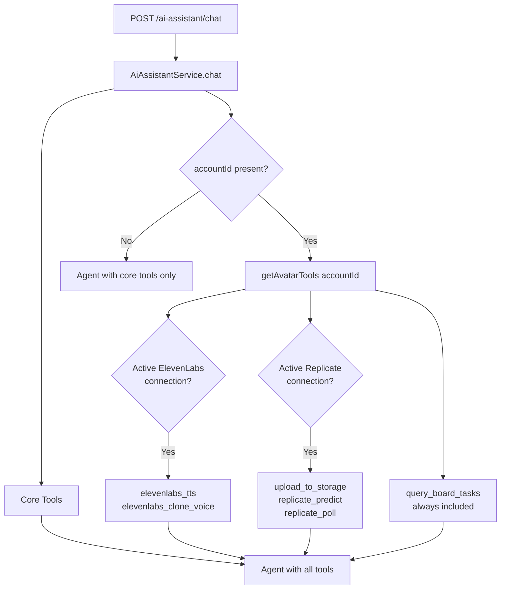
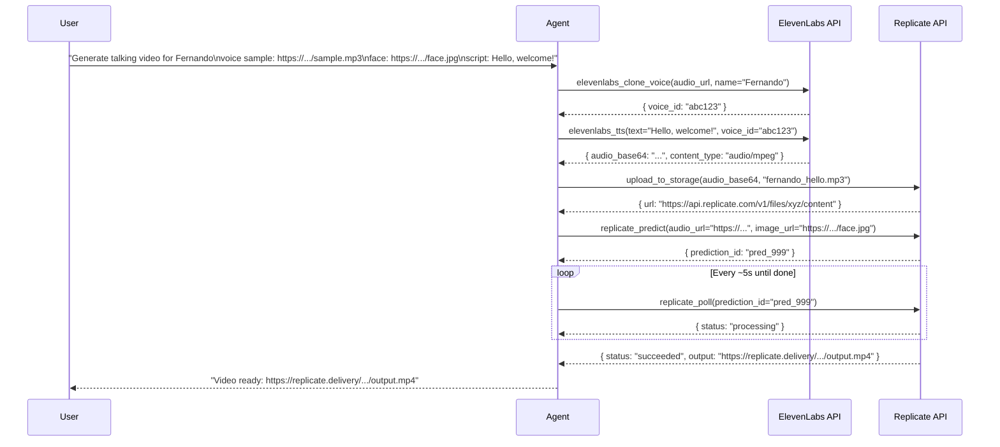

# AI Tools Reference

> **Status**: Stable v1.0
> **Stack**: LangChain `DynamicStructuredTool`, NestJS, ElevenLabs API, Replicate API

This document is the canonical reference for all tools available to the AI Assistant agent. It covers the tool system architecture, per-tool input/output contracts, integration requirements, and how tools are conditionally loaded at runtime.

For a higher-level overview of the AI Assistant module, see [ai-assistant.md](ai-assistant.md).

---

## Tool System Overview

All tools are implemented as `DynamicStructuredTool` instances from `@langchain/core/tools`. Each tool has:

- A `name` (snake_case) the LLM uses to invoke it
- A `description` that guides the LLM on when and how to use it
- A `schema` defined with Zod, which is compiled to a JSON Schema for the LLM's function-calling interface
- A `func` that receives validated inputs and returns a JSON string (or error string — tools never throw)

Tools are grouped into two categories:

| Category | Loaded When | Tools |
|---|---|---|
| **Core** | Every request | `perform_sql_query`, `semantic_search` |
| **Avatar** | `accountId` present + integration credentials found | `query_board_tasks`, `elevenlabs_tts`, `elevenlabs_clone_voice`, `upload_to_storage`, `replicate_predict`, `replicate_poll` |



---

## All Tools at a Glance

| Tool Name | Source File | Integration Required | Purpose |
|---|---|---|---|
| `perform_sql_query` | `tools/sql.tool.ts` | None | Read-only SQL SELECT on Supabase DB |
| `semantic_search` | _(embedding service)_ | OpenRouter API key | Vector similarity search |
| `query_board_tasks` | `tools/query-board-tasks.tool.ts` | None (supabaseAdmin) | Query TaskClaw board tasks |
| `elevenlabs_tts` | `tools/elevenlabs-tts.tool.ts` | ElevenLabs (`api_key`) | Text-to-speech, returns base64 MP3 |
| `elevenlabs_clone_voice` | `tools/elevenlabs-clone-voice.tool.ts` | ElevenLabs (`api_key`) | Instant Voice Cloning from audio URL |
| `upload_to_storage` | `tools/upload-to-storage.tool.ts` | Replicate (`api_key`) | Upload base64 file → public URL |
| `replicate_predict` | `tools/replicate-predict.tool.ts` | Replicate (`api_key`) | Start SadTalker lipsync prediction |
| `replicate_poll` | `tools/replicate-poll.tool.ts` | Replicate (`api_key`) | Poll prediction status → video URL |

---

## Tool Reference

### `perform_sql_query`

**File**: `backend/src/ai-assistant/tools/sql.tool.ts`
**Integration**: None

Executes a read-only SQL query against the Supabase database via the `exec_sql` RPC function. Inputs containing non-SELECT statements are rejected.

| Input | Type | Required | Description |
|---|---|---|---|
| `query` | `string` | Yes | A SQL SELECT statement |

**Output**: JSON string with rows, or an error message if the query is rejected or fails.

---

### `semantic_search`

**Integration**: OpenRouter API key (`OPENROUTER_API_KEY` env var)

Performs vector cosine similarity search. Falls back to ILIKE if embeddings are not configured or return sparse results.

| Input | Type | Required | Description |
|---|---|---|---|
| `query` | `string` | Yes | Natural language search query |
| `entity_type` | `string` | Yes | `"projects"`, `"users"`, or `"messages"` |
| `limit` | `number` | No | Max results (default 10) |

**Output**: JSON array of matching records with similarity scores.

---

### `query_board_tasks`

**File**: `backend/src/ai-assistant/tools/query-board-tasks.tool.ts`
**Integration**: None (uses `supabaseAdmin` directly, scoped by `accountId`)

Queries tasks from a TaskClaw board instance. Useful for reading workflow task data to feed into avatar or other automation flows.

| Input | Type | Required | Description |
|---|---|---|---|
| `board_name` | `string` | Yes | Board name to search for (partial, case-insensitive) |
| `step_name` | `string` | No | Column/step name to filter by (partial, case-insensitive) |
| `search_query` | `string` | No | Filter tasks by title (case-insensitive) |

**Output**:
```json
{
  "board_id": "uuid",
  "board_name": "My Board",
  "task_count": 3,
  "tasks": [
    {
      "id": "uuid",
      "title": "Task title",
      "input_fields": {},
      "output_fields": {},
      "metadata": {},
      "step_name": "In Progress"
    }
  ]
}
```

Up to 50 tasks are returned per call.

---

### `elevenlabs_tts`

**File**: `backend/src/ai-assistant/tools/elevenlabs-tts.tool.ts`
**Integration**: ElevenLabs — API key stored in `integration_connections.credentials` under slug `elevenlabs`
**Model**: `eleven_multilingual_v2`

Converts text to speech. The returned `audio_base64` should be passed to `upload_to_storage` before being used in `replicate_predict`.

| Input | Type | Required | Default | Description |
|---|---|---|---|---|
| `text` | `string` | Yes | — | Text to synthesize |
| `voice_id` | `string` | No | `21m00Tcm4TlvDq8ikWAM` (Rachel) | ElevenLabs voice ID |
| `stability` | `number` 0–1 | No | `0.5` | Voice stability |
| `similarity_boost` | `number` 0–1 | No | `0.75` | Similarity boost |
| `style` | `number` 0–1 | No | `0` | Style exaggeration |

**Output**:
```json
{
  "audio_base64": "<base64 MP3 data>",
  "content_type": "audio/mpeg",
  "char_count": 142
}
```

---

### `elevenlabs_clone_voice`

**File**: `backend/src/ai-assistant/tools/elevenlabs-clone-voice.tool.ts`
**Integration**: ElevenLabs — requires `create_instant_voice_clone` permission on the API key

Clones a voice using ElevenLabs Instant Voice Cloning. Fetches the audio file from the provided URL, assembles a multipart/form-data request, and calls `POST /v1/voices/add`. Audio samples of 30 seconds–3 minutes produce the best results.

| Input | Type | Required | Description |
|---|---|---|---|
| `name` | `string` | Yes | Display name for the cloned voice |
| `audio_url` | `string` | Yes | Public URL of a MP3 or WAV sample |
| `description` | `string` | No | Optional description |

**Output**:
```json
{
  "voice_id": "abc123",
  "name": "Fernando",
  "message": "Voice \"Fernando\" cloned successfully. Use voice_id \"abc123\" with elevenlabs_tts."
}
```

> If the API key lacks the `create_instant_voice_clone` permission, the tool returns a clear error with a link to the ElevenLabs API key settings page. It does not throw.

---

### `upload_to_storage`

**File**: `backend/src/ai-assistant/tools/upload-to-storage.tool.ts`
**Integration**: Replicate — API key stored in `integration_connections.credentials` under slug `replicate`

Uploads a base64-encoded file to the Replicate Files API (`POST /v1/files`) and returns a public HTTPS URL. Use this as the bridge between `elevenlabs_tts` (which returns base64) and `replicate_predict` (which requires a URL).

| Input | Type | Required | Default | Description |
|---|---|---|---|---|
| `audio_base64` | `string` | Yes | — | Base64-encoded file content |
| `file_name` | `string` | Yes | — | Filename with extension, e.g. `"voice.mp3"` |
| `content_type` | `string` | No | `"audio/mpeg"` | MIME type |

**Output**:
```json
{
  "url": "https://api.replicate.com/v1/files/abc/content",
  "file_id": "file_abc123"
}
```

---

### `replicate_predict`

**File**: `backend/src/ai-assistant/tools/replicate-predict.tool.ts`
**Integration**: Replicate — API key stored in `integration_connections.credentials` under slug `replicate`
**Model**: SadTalker `a519cc0cfebaaeade068b23899165a11ec76aaa1d2b313d40d214f204ec957a3`

Starts a Replicate SadTalker lip-sync prediction. This is an async operation — the prediction is queued and `prediction_id` is returned immediately. Use `replicate_poll` to wait for completion. Estimated cost ~$0.05 per video.

| Input | Type | Required | Default | Description |
|---|---|---|---|---|
| `audio_url` | `string` | Yes | — | Public URL of the audio file |
| `image_url` | `string` | Yes | — | Public URL of the face image to animate |
| `still_mode` | `boolean` | No | `true` | Fewer head movements |
| `use_enhancer` | `boolean` | No | `false` | GFPGAN face enhancer (slower, higher quality) |

**Output**:
```json
{
  "prediction_id": "abc123xyz",
  "status": "starting",
  "urls": {
    "get": "https://api.replicate.com/v1/predictions/abc123xyz",
    "cancel": "https://api.replicate.com/v1/predictions/abc123xyz/cancel"
  }
}
```

---

### `replicate_poll`

**File**: `backend/src/ai-assistant/tools/replicate-poll.tool.ts`
**Integration**: Replicate — API key stored in `integration_connections.credentials` under slug `replicate`

Polls a Replicate prediction by ID. Call this in a loop after `replicate_predict` until `status` is `"succeeded"` or `"failed"`. For SadTalker, `output` when succeeded is a string URL; for other models it may be an array (use `output[0]`).

| Input | Type | Required | Description |
|---|---|---|---|
| `prediction_id` | `string` | Yes | The ID returned by `replicate_predict` |

**Output** (in progress):
```json
{
  "status": "processing",
  "output": null,
  "error": null
}
```

**Output** (succeeded):
```json
{
  "status": "succeeded",
  "output": "https://replicate.delivery/pbxt/abc123/output.mp4",
  "error": null
}
```

---

## How Tools Are Loaded

Tool loading happens in `AiAssistantService` for every `chat()` call:

```typescript
// Simplified from ai-assistant.service.ts
async chat(message, history, user, conversationId, systemPromptKey) {
  // Core tools always present
  const tools = [sqlTool, semanticSearchTool];

  // Avatar tools loaded when accountId is provided
  if (user.accountId) {
    const avatarTools = await this.getAvatarTools(user.accountId);
    tools.push(...avatarTools);
  }

  const agent = createReactAgent({ llm: this.model, tools });
  // ...
}
```

The `getAvatarTools` method:

1. Always pushes `query_board_tasks` (no external credentials required).
2. Resolves integration definition IDs for slugs `elevenlabs` and `replicate` from `integration_definitions`.
3. Queries `integration_connections` for active connections matching the `accountId`.
4. Decrypts stored credentials inline using `decrypt()` from the crypto utility — no `IntegrationsModule` import needed, avoiding circular dependencies.
5. Pushes ElevenLabs tools if an `api_key` is found.
6. Pushes Replicate tools if an `api_key` is found.
7. Logs warnings on any decryption or lookup failures without throwing — the agent still runs with whatever tools loaded successfully.

---

## Integration Connection Requirements

### ElevenLabs

Create an integration connection with:
- **Slug**: `elevenlabs`
- **Credentials**: `{ "api_key": "sk_..." }`
- **Required permission** for voice cloning: `create_instant_voice_clone` — enable at [elevenlabs.io/app/settings/api-keys](https://elevenlabs.io/app/settings/api-keys)

Enables tools: `elevenlabs_tts`, `elevenlabs_clone_voice`

### Replicate

Create an integration connection with:
- **Slug**: `replicate`
- **Credentials**: `{ "api_key": "r8_..." }`

Enables tools: `upload_to_storage`, `replicate_predict`, `replicate_poll`

---

## Calling the Chat Endpoint with Avatar Tools

To activate avatar tools, pass `accountId` and `systemPromptKey: "avatar"` in the request body:

```typescript
// Frontend: frontend/src/app/dashboard/chat/actions.ts
const response = await fetch(`${API_URL}/ai-assistant/chat`, {
  method: 'POST',
  headers: {
    'Authorization': `Bearer ${session.access_token}`,
    'Content-Type': 'application/json',
  },
  body: JSON.stringify({
    message: "Generate a talking video with Fernando's voice cloned from https://example.com/sample.mp3 and face from https://example.com/face.jpg saying: 'Hello, welcome to TaskClaw!'",
    history: [],
    systemPromptKey: 'avatar',
    accountId: 'your-account-uuid-here',
  }),
});
```

```bash
# cURL equivalent
curl -X POST http://localhost:3003/ai-assistant/chat \
  -H "Authorization: Bearer YOUR_JWT_TOKEN" \
  -H "Content-Type: application/json" \
  -d '{
    "message": "Generate a talking video with Fernando'\''s voice cloned from https://example.com/sample.mp3 and face from https://example.com/face.jpg saying: '\''Hello, welcome to TaskClaw!'\''",
    "history": [],
    "systemPromptKey": "avatar",
    "accountId": "550e8400-e29b-41d4-a716-446655440000"
  }'
```

The agent will autonomously chain the tools in the correct order and return the final video URL.

---

## Avatar Generation Flow (Full Example)



---

## Error Handling

All tools follow the same error contract: they **never throw**. On failure they return a JSON error string:

```json
{ "error": "ElevenLabs API error 401: missing_permissions" }
```

The agent receives the error as tool output and can either retry, explain the problem to the user, or attempt an alternative approach. This prevents a single tool failure from crashing the entire agent run.

**Common errors to watch for:**

| Error Pattern | Cause | Resolution |
|---|---|---|
| `missing_permissions` / `create_instant_voice_clone` | ElevenLabs API key lacks voice cloning permission | Regenerate key with the permission at elevenlabs.io |
| `Replicate API error 401` | Invalid or expired Replicate API key | Update the Replicate integration connection credentials |
| `No board found matching "X"` | Board name typo or wrong account | Check board names in the TaskClaw dashboard |
| `Failed to decrypt ElevenLabs credentials` | Credential encryption mismatch | Re-save the integration connection |
| `getAvatarTools failed` | Supabase query error | Check backend logs, verify `integration_definitions` table has `elevenlabs`/`replicate` slugs |

---

## Adding a New Tool

1. Create `backend/src/ai-assistant/tools/my-tool.tool.ts`:

```typescript
import { DynamicStructuredTool } from '@langchain/core/tools';
import { z } from 'zod';

export function createMyTool(apiKey: string): DynamicStructuredTool {
  return new DynamicStructuredTool({
    name: 'my_tool',
    description: 'Clear description of when the LLM should use this tool.',
    schema: z.object({
      param1: z.string().describe('What this param means'),
      param2: z.number().optional().default(10).describe('Optional with default'),
    }),
    func: async ({ param1, param2 }) => {
      try {
        // Implementation
        return JSON.stringify({ result: 'success' });
      } catch (e: any) {
        return JSON.stringify({ error: e.message }); // Never throw
      }
    },
  });
}
```

2. Register it in `AiAssistantService`:
   - For always-on tools: add to the `tools` array in `chat()` directly.
   - For credential-gated tools: add to `getAvatarTools()` after decrypting the appropriate integration connection.

3. If the tool requires a new integration, add the integration slug to the `IN ('elevenlabs', 'replicate', 'your-slug')` query inside `getAvatarTools()`.

4. Update `system-prompt.ts` if the tool should be described in a prompt (e.g., add it to `AVATAR_ASSISTANT_PROMPT`).
