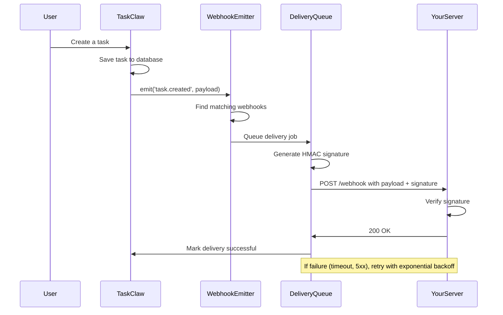

# Webhooks

> Status: Production-ready
> Stack: HMAC-SHA256, Node.js, PostgreSQL, BullMQ
> Related Docs: [API Keys](./authentication-authorization.md#api-key-authentication), [Architecture](../architecture.md)

## Overview & Key Concepts

TaskClaw's webhook system allows external applications to receive real-time notifications when events occur in your account. Webhooks are HTTP callbacks that TaskClaw sends to your server whenever a task is created, a board is updated, a sync completes, or any other tracked event happens.

### What Are Webhooks?

Webhooks are **"reverse APIs"** — instead of your application polling TaskClaw for updates, TaskClaw proactively sends updates to your application when they happen.

**Traditional polling:**
```
Your App → [Every 60 seconds] → TaskClaw API: "Any new tasks?"
```

**Webhooks:**
```
TaskClaw → [Task created!] → Your App: POST /webhooks with event data
```

### Why Use Webhooks?

- **Real-time updates**: React to events instantly, no polling delays
- **Efficiency**: No wasted API calls checking for changes
- **Automation**: Trigger workflows in other systems (Slack, Discord, CI/CD)
- **Auditability**: Track all events with delivery history

### Key Concepts

- **Webhook**: A configured endpoint (URL + events + secret)
- **Event**: A tracked action (e.g., `task.created`, `board.updated`)
- **Payload**: JSON data sent to your endpoint
- **Delivery**: A single HTTP POST attempt to your endpoint
- **Signature**: HMAC-SHA256 hash for verifying payload authenticity
- **Retry**: Automatic re-delivery on failure (exponential backoff)

---

## Architecture & How It Works

### Webhook Flow



### Webhook Lifecycle

1. **Configuration**: Admin creates webhook via API or UI
2. **Event emission**: Service layer emits events when actions occur
3. **Matching**: WebhookEmitter finds webhooks subscribed to that event
4. **Delivery**: Queue sends HTTP POST to webhook URL
5. **Verification**: Your server verifies HMAC signature
6. **Processing**: Your server handles the event
7. **Retry (if needed)**: Failed deliveries are retried up to 3 times

---

## Event Types & Payloads

TaskClaw emits the following webhook events:

### Task Events

#### `task.created`

Fired when a task is created.

**Payload:**
```json
{
  "event": "task.created",
  "timestamp": "2025-01-15T10:00:00Z",
  "account_id": "550e8400-e29b-41d4-a716-446655440000",
  "data": {
    "id": "task-123",
    "title": "Fix authentication bug",
    "description": "Users can't log in with GitHub OAuth",
    "priority": "high",
    "status": "todo",
    "board_id": "board-456",
    "step_id": "step-789",
    "created_by": "user-abc",
    "created_at": "2025-01-15T10:00:00Z"
  }
}
```

#### `task.updated`

Fired when a task is updated (title, description, priority, etc.).

**Payload:**
```json
{
  "event": "task.updated",
  "timestamp": "2025-01-15T10:05:00Z",
  "account_id": "550e8400-e29b-41d4-a716-446655440000",
  "data": {
    "id": "task-123",
    "title": "Fix authentication bug [URGENT]",
    "priority": "critical",
    "updated_by": "user-abc",
    "updated_at": "2025-01-15T10:05:00Z",
    "changes": {
      "title": {
        "old": "Fix authentication bug",
        "new": "Fix authentication bug [URGENT]"
      },
      "priority": {
        "old": "high",
        "new": "critical"
      }
    }
  }
}
```

#### `task.moved`

Fired when a task is moved to a different step/column.

**Payload:**
```json
{
  "event": "task.moved",
  "timestamp": "2025-01-15T10:10:00Z",
  "account_id": "550e8400-e29b-41d4-a716-446655440000",
  "data": {
    "id": "task-123",
    "step_id": "step-999",
    "previous_step_id": "step-789",
    "moved_by": "user-abc",
    "moved_at": "2025-01-15T10:10:00Z"
  }
}
```

#### `task.completed`

Fired when a task is marked as completed.

**Payload:**
```json
{
  "event": "task.completed",
  "timestamp": "2025-01-15T10:15:00Z",
  "account_id": "550e8400-e29b-41d4-a716-446655440000",
  "data": {
    "id": "task-123",
    "completed_by": "user-abc",
    "completed_at": "2025-01-15T10:15:00Z"
  }
}
```

#### `task.deleted`

Fired when a task is deleted.

**Payload:**
```json
{
  "event": "task.deleted",
  "timestamp": "2025-01-15T10:20:00Z",
  "account_id": "550e8400-e29b-41d4-a716-446655440000",
  "data": {
    "id": "task-123",
    "deleted_by": "user-abc",
    "deleted_at": "2025-01-15T10:20:00Z"
  }
}
```

### Board Events

#### `board.created`

Fired when a board is created.

**Payload:**
```json
{
  "event": "board.created",
  "timestamp": "2025-01-15T10:00:00Z",
  "account_id": "550e8400-e29b-41d4-a716-446655440000",
  "data": {
    "id": "board-456",
    "name": "Q1 Roadmap",
    "description": "Product roadmap for Q1 2025",
    "created_by": "user-abc",
    "created_at": "2025-01-15T10:00:00Z"
  }
}
```

#### `board.updated`

Fired when a board is updated.

**Payload:**
```json
{
  "event": "board.updated",
  "timestamp": "2025-01-15T10:05:00Z",
  "account_id": "550e8400-e29b-41d4-a716-446655440000",
  "data": {
    "id": "board-456",
    "name": "Q1 Product Roadmap",
    "updated_by": "user-abc",
    "updated_at": "2025-01-15T10:05:00Z",
    "changes": {
      "name": {
        "old": "Q1 Roadmap",
        "new": "Q1 Product Roadmap"
      }
    }
  }
}
```

#### `board.deleted`

Fired when a board is deleted.

**Payload:**
```json
{
  "event": "board.deleted",
  "timestamp": "2025-01-15T10:10:00Z",
  "account_id": "550e8400-e29b-41d4-a716-446655440000",
  "data": {
    "id": "board-456",
    "deleted_by": "user-abc",
    "deleted_at": "2025-01-15T10:10:00Z"
  }
}
```

### Conversation Events

#### `conversation.created`

Fired when a conversation is created.

**Payload:**
```json
{
  "event": "conversation.created",
  "timestamp": "2025-01-15T10:00:00Z",
  "account_id": "550e8400-e29b-41d4-a716-446655440000",
  "data": {
    "id": "conv-123",
    "title": "Debug OAuth issue",
    "task_id": "task-456",
    "created_by": "user-abc",
    "created_at": "2025-01-15T10:00:00Z"
  }
}
```

#### `message.created`

Fired when a message is sent in a conversation.

**Payload:**
```json
{
  "event": "message.created",
  "timestamp": "2025-01-15T10:01:00Z",
  "account_id": "550e8400-e29b-41d4-a716-446655440000",
  "data": {
    "id": "msg-789",
    "conversation_id": "conv-123",
    "role": "user",
    "content": "What could cause GitHub OAuth to fail?",
    "created_by": "user-abc",
    "created_at": "2025-01-15T10:01:00Z"
  }
}
```

### Sync Events

#### `sync.completed`

Fired when a background sync job completes successfully.

**Payload:**
```json
{
  "event": "sync.completed",
  "timestamp": "2025-01-15T10:00:00Z",
  "account_id": "550e8400-e29b-41d4-a716-446655440000",
  "data": {
    "source_id": "source-123",
    "job_id": "job-456",
    "provider": "notion",
    "tasks_synced": 42,
    "duration_ms": 3500,
    "completed_at": "2025-01-15T10:00:00Z"
  }
}
```

#### `sync.failed`

Fired when a sync job fails.

**Payload:**
```json
{
  "event": "sync.failed",
  "timestamp": "2025-01-15T10:00:00Z",
  "account_id": "550e8400-e29b-41d4-a716-446655440000",
  "data": {
    "source_id": "source-123",
    "job_id": "job-456",
    "provider": "notion",
    "error": "Notion API rate limit exceeded",
    "failed_at": "2025-01-15T10:00:00Z"
  }
}
```

---

## Creating and Managing Webhooks

### Creating a Webhook

#### Via Web UI

1. Log in to TaskClaw
2. Navigate to **Settings > Webhooks**
3. Click **Create Webhook**
4. Fill in the form:
   - **URL**: Your endpoint (must be HTTPS in production)
   - **Secret**: A random string for signature verification (auto-generated or custom)
   - **Events**: Check the events you want to receive
   - **Active**: Toggle to enable/disable the webhook
5. Click **Create**

#### Via API

**Endpoint**: `POST /accounts/:id/webhooks`

**Request:**
```bash
curl -X POST http://localhost:3003/accounts/550e8400-e29b-41d4-a716-446655440000/webhooks \
  -H "Authorization: Bearer <your-jwt-or-api-key>" \
  -H "Content-Type: application/json" \
  -d '{
    "url": "https://your-app.com/webhooks/taskclaw",
    "secret": "whsec_your-secret-key",
    "events": ["task.created", "task.updated", "task.completed"],
    "active": true
  }'
```

**Response:**
```json
{
  "id": "webhook-123",
  "url": "https://your-app.com/webhooks/taskclaw",
  "secret": "whsec_your-secret-key",
  "events": ["task.created", "task.updated", "task.completed"],
  "active": true,
  "created_at": "2025-01-15T10:00:00Z"
}
```

### Listing Webhooks

**Endpoint**: `GET /accounts/:id/webhooks`

```bash
curl http://localhost:3003/accounts/550e8400-e29b-41d4-a716-446655440000/webhooks \
  -H "Authorization: Bearer <your-jwt-or-api-key>"
```

**Response:**
```json
{
  "webhooks": [
    {
      "id": "webhook-123",
      "url": "https://your-app.com/webhooks/taskclaw",
      "events": ["task.created", "task.updated"],
      "active": true,
      "created_at": "2025-01-15T10:00:00Z"
    }
  ]
}
```

### Updating a Webhook

**Endpoint**: `PATCH /accounts/:id/webhooks/:webhookId`

```bash
curl -X PATCH http://localhost:3003/accounts/550e8400-e29b-41d4-a716-446655440000/webhooks/webhook-123 \
  -H "Authorization: Bearer <your-jwt-or-api-key>" \
  -H "Content-Type: application/json" \
  -d '{
    "active": false
  }'
```

### Deleting a Webhook

**Endpoint**: `DELETE /accounts/:id/webhooks/:webhookId`

```bash
curl -X DELETE http://localhost:3003/accounts/550e8400-e29b-41d4-a716-446655440000/webhooks/webhook-123 \
  -H "Authorization: Bearer <your-jwt-or-api-key>"
```

### Viewing Delivery History

**Endpoint**: `GET /accounts/:id/webhooks/:webhookId/deliveries`

```bash
curl http://localhost:3003/accounts/550e8400-e29b-41d4-a716-446655440000/webhooks/webhook-123/deliveries \
  -H "Authorization: Bearer <your-jwt-or-api-key>"
```

**Response:**
```json
{
  "deliveries": [
    {
      "id": "delivery-456",
      "event": "task.created",
      "status": "success",
      "response_code": 200,
      "attempts": 1,
      "created_at": "2025-01-15T10:00:00Z",
      "delivered_at": "2025-01-15T10:00:01Z"
    },
    {
      "id": "delivery-457",
      "event": "task.updated",
      "status": "failed",
      "response_code": 500,
      "attempts": 3,
      "next_retry_at": "2025-01-15T10:10:00Z",
      "created_at": "2025-01-15T10:05:00Z"
    }
  ]
}
```

---

## HMAC Signature Verification

All webhook deliveries include an **HMAC-SHA256 signature** in the `X-TaskClaw-Signature` header. You **MUST verify this signature** to ensure the payload was sent by TaskClaw and hasn't been tampered with.

### How HMAC Verification Works

1. TaskClaw generates a signature using your webhook secret:
   ```
   HMAC-SHA256(secret, payload_body)
   ```
2. The signature is sent in the `X-TaskClaw-Signature` header
3. Your server computes the same signature using the payload and your secret
4. If the signatures match, the payload is authentic

### Verification Examples

#### Node.js (Express)

```javascript
const crypto = require('crypto');
const express = require('express');

const app = express();

// IMPORTANT: Use raw body for signature verification
app.post('/webhooks/taskclaw', express.raw({ type: 'application/json' }), (req, res) => {
  const signature = req.headers['x-taskclaw-signature'];
  const secret = process.env.WEBHOOK_SECRET; // Your webhook secret

  // Compute expected signature
  const hmac = crypto.createHmac('sha256', secret);
  hmac.update(req.body); // req.body is raw Buffer
  const expectedSignature = hmac.digest('hex');

  // Verify signature
  if (signature !== expectedSignature) {
    console.error('Invalid signature');
    return res.status(401).send('Unauthorized');
  }

  // Parse payload (now safe to parse)
  const payload = JSON.parse(req.body.toString());

  // Handle event
  console.log('Event received:', payload.event);
  console.log('Data:', payload.data);

  // Respond quickly (process async if needed)
  res.status(200).send('OK');
});

app.listen(3000);
```

#### Python (Flask)

```python
import hmac
import hashlib
from flask import Flask, request

app = Flask(__name__)

@app.route('/webhooks/taskclaw', methods=['POST'])
def webhook():
    signature = request.headers.get('X-TaskClaw-Signature')
    secret = 'your-webhook-secret'

    # Compute expected signature
    hmac_obj = hmac.new(
        secret.encode('utf-8'),
        request.data,
        hashlib.sha256
    )
    expected_signature = hmac_obj.hexdigest()

    # Verify signature
    if signature != expected_signature:
        print('Invalid signature')
        return 'Unauthorized', 401

    # Parse payload
    payload = request.get_json()

    # Handle event
    print(f"Event received: {payload['event']}")
    print(f"Data: {payload['data']}")

    return 'OK', 200

if __name__ == '__main__':
    app.run(port=3000)
```

#### Ruby (Sinatra)

```ruby
require 'sinatra'
require 'openssl'
require 'json'

post '/webhooks/taskclaw' do
  signature = request.env['HTTP_X_TASKCLAW_SIGNATURE']
  secret = ENV['WEBHOOK_SECRET']

  # Compute expected signature
  body = request.body.read
  expected_signature = OpenSSL::HMAC.hexdigest(
    OpenSSL::Digest.new('sha256'),
    secret,
    body
  )

  # Verify signature
  unless Rack::Utils.secure_compare(signature, expected_signature)
    halt 401, 'Unauthorized'
  end

  # Parse payload
  payload = JSON.parse(body)

  # Handle event
  puts "Event received: #{payload['event']}"
  puts "Data: #{payload['data']}"

  status 200
end
```

---

## Retry Behavior and Delivery Tracking

### Retry Logic

If your server fails to acknowledge a webhook delivery (non-2xx status code, timeout, or network error), TaskClaw will automatically retry the delivery with **exponential backoff**:

| Attempt | Delay |
|---------|-------|
| 1st | Immediate |
| 2nd | 60 seconds |
| 3rd | 5 minutes |

After 3 failed attempts, the delivery is marked as **permanently failed** and no more retries occur.

### Timeouts

Webhook requests timeout after **10 seconds**. Your endpoint must respond within 10 seconds or the delivery will be marked as failed and retried.

### Idempotency

Webhooks may be delivered **more than once** (in case of retries or network issues). Your application should handle duplicate deliveries gracefully by:

- Storing processed event IDs in a database
- Checking if an event ID has already been processed before handling it

**Example idempotency check:**

```javascript
app.post('/webhooks/taskclaw', async (req, res) => {
  const payload = JSON.parse(req.body.toString());
  const eventId = payload.id; // Unique event ID

  // Check if already processed
  const alreadyProcessed = await db.checkEventProcessed(eventId);
  if (alreadyProcessed) {
    return res.status(200).send('Already processed');
  }

  // Process event
  await handleEvent(payload);

  // Mark as processed
  await db.markEventProcessed(eventId);

  res.status(200).send('OK');
});
```

---

## Best Practices

### 1. Verify Signatures on Every Request

❌ **Bad**: Skipping signature verification

```javascript
app.post('/webhooks/taskclaw', (req, res) => {
  const payload = JSON.parse(req.body); // Dangerous!
  handleEvent(payload);
  res.send('OK');
});
```

✅ **Good**: Always verify signatures

```javascript
app.post('/webhooks/taskclaw', (req, res) => {
  if (!verifySignature(req.headers['x-taskclaw-signature'], req.body)) {
    return res.status(401).send('Unauthorized');
  }
  // Safe to process
});
```

### 2. Respond Quickly (< 10 seconds)

Webhook endpoints should respond immediately (within 10 seconds). If processing takes longer, queue the work asynchronously.

❌ **Bad**: Slow processing blocks response

```javascript
app.post('/webhooks/taskclaw', async (req, res) => {
  await processEvent(req.body); // May take > 10 seconds
  res.send('OK');
});
```

✅ **Good**: Queue work, respond immediately

```javascript
app.post('/webhooks/taskclaw', async (req, res) => {
  await queue.add('process-webhook', req.body); // Queue async
  res.send('OK'); // Respond immediately
});
```

### 3. Handle Idempotency

Store processed event IDs to prevent duplicate processing:

```javascript
const processedEvents = new Set(); // Or use a database

app.post('/webhooks/taskclaw', (req, res) => {
  const payload = JSON.parse(req.body.toString());

  if (processedEvents.has(payload.id)) {
    return res.status(200).send('Already processed');
  }

  handleEvent(payload);
  processedEvents.add(payload.id);

  res.send('OK');
});
```

### 4. Use HTTPS in Production

Webhook URLs **must use HTTPS** in production to prevent man-in-the-middle attacks. TaskClaw will reject `http://` URLs unless running in development mode.

### 5. Log Delivery Failures

Monitor webhook delivery history for failures:

```bash
curl http://localhost:3003/accounts/550e8400-e29b-41d4-a716-446655440000/webhooks/webhook-123/deliveries \
  -H "Authorization: Bearer <your-jwt-or-api-key>"
```

Set up alerts for repeated failures to catch issues early.

---

## Example: Setting Up a Webhook Consumer

Here's a complete example of a webhook consumer in Node.js:

```javascript
const express = require('express');
const crypto = require('crypto');

const app = express();
const WEBHOOK_SECRET = process.env.WEBHOOK_SECRET;

// Processed event IDs (use Redis or DB in production)
const processedEvents = new Set();

// Webhook endpoint
app.post('/webhooks/taskclaw', express.raw({ type: 'application/json' }), (req, res) => {
  // 1. Verify signature
  const signature = req.headers['x-taskclaw-signature'];
  const hmac = crypto.createHmac('sha256', WEBHOOK_SECRET);
  hmac.update(req.body);
  const expectedSignature = hmac.digest('hex');

  if (signature !== expectedSignature) {
    console.error('[Webhook] Invalid signature');
    return res.status(401).send('Unauthorized');
  }

  // 2. Parse payload
  const payload = JSON.parse(req.body.toString());
  console.log(`[Webhook] Event received: ${payload.event}`);

  // 3. Check idempotency
  if (processedEvents.has(payload.id)) {
    console.log(`[Webhook] Event ${payload.id} already processed`);
    return res.status(200).send('Already processed');
  }

  // 4. Handle event
  handleEvent(payload);

  // 5. Mark as processed
  processedEvents.add(payload.id);

  // 6. Respond quickly
  res.status(200).send('OK');
});

function handleEvent(payload) {
  switch (payload.event) {
    case 'task.created':
      console.log(`New task created: ${payload.data.title}`);
      // Send Slack notification, trigger CI/CD, etc.
      break;

    case 'task.completed':
      console.log(`Task completed: ${payload.data.id}`);
      // Update external system, send celebration message, etc.
      break;

    case 'sync.failed':
      console.error(`Sync failed: ${payload.data.error}`);
      // Alert ops team, retry manually, etc.
      break;

    default:
      console.log(`Unhandled event: ${payload.event}`);
  }
}

app.listen(3000, () => {
  console.log('Webhook consumer running on port 3000');
});
```

---

## Troubleshooting

### Error: "Invalid signature"

**Cause**: HMAC signature doesn't match.

**Solutions**:
- Verify you're using the correct webhook secret
- Ensure you're computing HMAC over the **raw request body** (not parsed JSON)
- Check that your secret matches the one configured in TaskClaw

### Deliveries timing out

**Cause**: Your endpoint takes > 10 seconds to respond.

**Solutions**:
- Queue long-running work asynchronously
- Respond with `200 OK` immediately after queuing
- Optimize your processing logic

### Duplicate deliveries

**Cause**: Normal behavior due to retries or network issues.

**Solution**: Implement idempotency checks (see [Best Practices](#best-practices)).

### Webhook URL rejected

**Cause**: Using `http://` in production.

**Solution**: Use `https://` URLs. For local testing, use a tunnel service like ngrok:

```bash
ngrok http 3000
# Use the HTTPS URL (https://abc123.ngrok.io) as your webhook URL
```

---

## Related Documentation

- [API Keys](./authentication-authorization.md#api-key-authentication) — API key authentication
- [Architecture](../architecture.md) — System architecture overview
- [MCP Server](../mcp-server.md) — Model Context Protocol server

### External Resources

- [HMAC-SHA256 Specification](https://tools.ietf.org/html/rfc2104)
- [Webhook Best Practices](https://github.com/brandur/webhooks)
